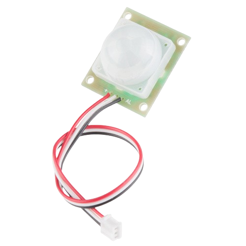
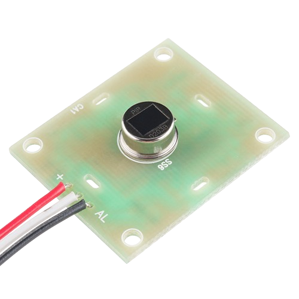
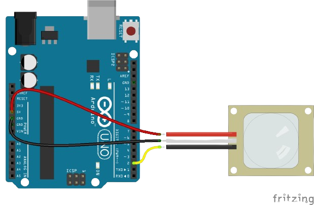

# Moving-object-detection
Passive infrared (PIR) sensors are motion-detecting devices used in security systems across the world -- even though you may not see them, they probably see you!
This is a simple to use motion sensor. Power it up and wait 1-2 seconds for the sensor to get a snapshot of the still room. If anything moves after that period, the 'alarm' pin will go low.![image]

 # PIR Motion Sensor Overview
PIR sensor's are infrared-sensitive light detectors. By monitoring light in the infrared spectrum, PIR sensors can sense subtle changes in temperature across the area they're viewing. When a human or some other object comes into the PIR's field-of-view, the radiation pattern changes, and the PIR interprets that change as movement.
That white cap dominating most of the top side of the PIR assembly is a lense, which helps focus the PIR sensor's field-of-view. The actual PIR sensor is hiding under that lense:

| Wire Color    | Pin           | Notes |
| ------------- | ------------- | ------------- |
| red | power  | 5v to 12 v  |
| white  | ground  |  |
| black  | alarm  | Open-collector output – active low |

# Example Circuit
The circuit for this example is about as simple as it gets. Grab three jumper wires and insert them into the JST connector.It gets a little tight, but they should all be able to fit in there.

Connect the power (red) and ground (white) wires up to 5V and GND respectively. Then connect the black alarm wire to Arduino pin 2.

We'll use the internal pull-up resistor on D2 to complete the circuit. Whenever the sensor is inactive, the pin should read high. When motion is detected, the sensor will pull D2 low.

# Real-World Applications
Security systems:  
	Trigger alarms or lights upon detecting intruders.
Home automation: 
	 Turn on lights or appliances when someone enters a room.
Interactive projects:
	Create sensor-driven games, art installations, or environmental monitors.
# Advantages Of PIR Sensor
Following are the benefits or advantages of PIR sensor:➨Detects motion reliably in indoors as well as in day or dark.➨It consumes less energy (0.8W to 1.0W) compare to microwave sensor.➨They are cheaper compare to microwave sensors.➨They are good for electrical applications used in smaller and compact premises.
# Disadvantages Of PIR Sensor

Following are the drawbacks or disadvantages of PIR sensor:➨They have lower sensitivity and less coverage compare to microwave sensors.➨It does not operate greater than 35 degree C.➨It works effectively in LOS (Line of Sight) and will have problems in the corner regions.➨It is insensitive to very slow motion of the objects.
# Thank You
